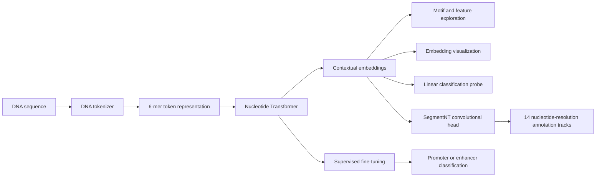

# DNA Foundation Models Tutorial

## From Nucleotide Transformer embeddings to single-nucleotide genome annotation

[](https://github.com/pyareedash/DNA-FMs)
[](https://www.python.org/)
[](https://huggingface.co/)

A hands-on tutorial introducing **DNA foundation models**, with a particular focus on the **Nucleotide Transformer** family and **SegmentNT**.

The notebooks move from fundamental DNA sequence representations to contextual embeddings, biological feature exploration, supervised fine-tuning, and nucleotide-resolution genome annotation.

This tutorial was prepared for the **Ensembl Genomes Hackathon Workshop**.

---

## Run the tutorials

### Part 1 — Nucleotide Transformers and fine-tuning

[](https://colab.research.google.com/github/pyareedash/DNA-FMs/blob/main/T1_workshop_FM_NT.ipynb)

### Part 2 — SegmentNT inference

[](https://colab.research.google.com/github/pyareedash/DNA-FMs/blob/main/T2_workshop_sNT_infer.ipynb)

Google Colab is the easiest way to run the tutorials because the notebooks install their required dependencies and can use a hosted GPU runtime.

---

## Overview

Foundation models learn general-purpose representations from large collections of unlabeled data. In genomics, these models are trained on DNA sequences and can learn contextual patterns associated with motifs, regulatory elements, genes, sequence composition, and other biological properties.

However, a DNA foundation model is shaped by several design decisions:

* How the nucleotide sequence is tokenized
* Which genomes and species are included during pretraining
* The model architecture and context length
* The self-supervised training objective
* Which model layer is used to extract representations
* How sequence-level or nucleotide-level predictions are constructed

This repository explores these ideas through two complementary tutorials.

| Tutorial   | Main focus                                                                                                        | Model                                            |
| ---------- | ----------------------------------------------------------------------------------------------------------------- | ------------------------------------------------ |
| **Part 1** | DNA encoding, tokenization, contextual embeddings, biological interpretation, probing, and supervised fine-tuning | Nucleotide Transformer                           |
| **Part 2** | Genome annotation at single-nucleotide resolution                                                                 | SegmentNT with a Nucleotide Transformer backbone |

---

## Learning objectives

After completing the tutorials, you should be able to:

1. Explain why biological sequences require appropriate numerical representations.
2. Compare one-hot encoding with learned token embeddings.
3. Understand how k-mer tokenization is applied to DNA sequences.
4. Load a pretrained Nucleotide Transformer from Hugging Face.
5. Extract contextual representations from different transformer layers.
6. Explore whether embedding components respond to sequence motifs or genomic features.
7. Evaluate pretrained embeddings using visualization and supervised probes.
8. Fine-tune a DNA foundation model for binary sequence classification.
9. Evaluate genomic classifiers using F1 score and Matthews correlation coefficient.
10. Use SegmentNT to generate nucleotide-resolution genome annotation tracks.
11. Recognize important computational, reproducibility, and data-leakage considerations when working with genomic foundation models.

---

## Tutorial workflow



---

## Repository structure

```text
DNA-FMs/
├── README.md
├── T1_workshop_FM_NT.ipynb
└── T2_workshop_sNT_infer.ipynb
```

### `T1_workshop_FM_NT.ipynb`

Introduces DNA foundation-model concepts and demonstrates how to:

* Represent DNA sequences as strings and numerical tensors
* Calculate basic sequence properties
* Construct one-hot encodings
* Understand k-mer tokenization
* Load and inspect a Nucleotide Transformer
* Extract hidden-state representations
* Investigate motif-associated embedding components
* Annotate biological features such as TATA boxes and translated regions
* Evaluate sequence embeddings with PCA and logistic regression
* Fine-tune a Nucleotide Transformer for promoter and enhancer classification

### `T2_workshop_sNT_infer.ipynb`

Introduces SegmentNT and demonstrates how to:

* Load the pretrained SegmentNT architecture
* Combine Nucleotide Transformer embeddings with a segmentation head
* Retrieve a genomic region from Ensembl
* Divide long genomic regions into model-compatible windows
* Produce nucleotide-level predictions across 14 annotation tracks
* Visualize predicted genome annotations as heatmaps
* Run the model on a user-selected genomic interval

---

## Troubleshooting

### CUDA out-of-memory error

Reduce the batch size or sequence length and restart the runtime to release cached GPU memory.

For fine-tuning, also consider gradient accumulation, mixed precision, partial freezing, or a smaller model.

### Model download fails

Confirm that:

* The runtime has internet access
* Hugging Face is reachable
* Sufficient disk space is available
* The selected model repository is public
* The local Hugging Face cache is writable

### SegmentNT checkpoint download fails

The SegmentNT head is downloaded using `gdown`. Network restrictions or changes to the hosted file may interrupt the download. Confirm that the checkpoint file exists and was downloaded completely before initializing the model.

### Ensembl request fails

Ensembl REST requests can fail because of:

* Temporary service unavailability
* Invalid genomic coordinates
* An unsupported species name
* Missing request headers
* Excessively large requests

Test a smaller interval and verify the coordinates in the Ensembl genome browser.

### Unexpected sequence length

SegmentNT windows are padded to the model’s expected size. Ensure that padded positions are removed after prediction before interpreting or plotting the reconstructed genomic interval.

### Dependency conflicts

Create a clean environment and install compatible versions of PyTorch, Transformers, Accelerate, and Datasets. Pinning known working versions is recommended for workshops and long-term reproducibility.

---

## References and resources

1. **Dalla-Torre et al.**
   *The Nucleotide Transformer: Building and Evaluating Robust Foundation Models for Human Genomics.*

2. **Benegas et al.**
   *SegmentNT: Annotating the genome at single-nucleotide resolution with DNA foundation models.*
   https://www.biorxiv.org/content/10.1101/2023.05.24.542096v1

3. **Nucleotide Transformer models on Hugging Face**
   https://huggingface.co/InstaDeepAI

4. **Nucleotide Transformer repository**
   https://github.com/instadeepai/nucleotide-transformer

5. **Genomic Benchmarks**
   https://github.com/ML-Bioinfo-CEITEC/genomic_benchmarks

6. **Ensembl REST API**
   https://rest.ensembl.org/

7. **Ensembl Genome Browser**
   https://www.ensembl.org/

8. **JASPAR transcription-factor binding profiles**
   https://jaspar.elixir.no/

9. **Eukaryotic Promoter Database**
   https://epd.expasy.org/epd/

---

## Acknowledgements

This tutorial was prepared for the **Kircherlab Workshop**.

The notebooks build on models, datasets, code examples, and educational resources developed by the Nucleotide Transformer, SegmentNT, InstaDeep, Hugging Face, Ensembl, JASPAR, Genomic Benchmarks, and broader computational-genomics communities.

The SegmentNT inference notebook is adapted from the official Nucleotide Transformer example:

```text
instadeepai/nucleotide-transformer/notebooks/inference_segment_nt.ipynb
```

Please cite the original model, dataset, and software publications when using or adapting material from this repository.

---

## Contributing

Suggestions, corrections, and educational improvements are welcome.

You can contribute by:

1. Opening an issue describing the proposed change
2. Forking the repository
3. Creating a focused branch
4. Updating the notebook or documentation
5. Opening a pull request with a clear explanation of the change

Potential contributions include additional exercises, tested environments, alternative models, new genomic datasets, improved visualizations, and reproducibility fixes.

---

## License

No license file is currently included in this repository.

Unless a license is added, standard copyright restrictions apply. Contact the repository owner before redistributing or substantially reusing the tutorial materials.

---

## Author

**Pyaree Mohan Dash**

* GitHub: [@pyareedash](https://github.com/pyareedash)
* Portfolio: [pyareedash.github.io](https://pyareedash.github.io/)

---

> DNA foundation models provide powerful representations, but their outputs become biologically useful only when paired with careful evaluation, appropriate datasets, reproducible workflows, and domain knowledge.
